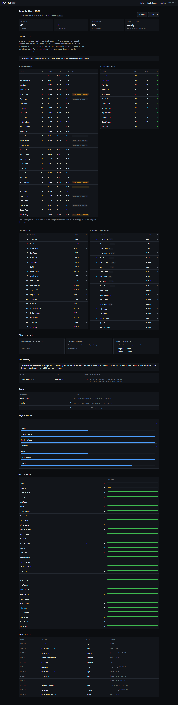
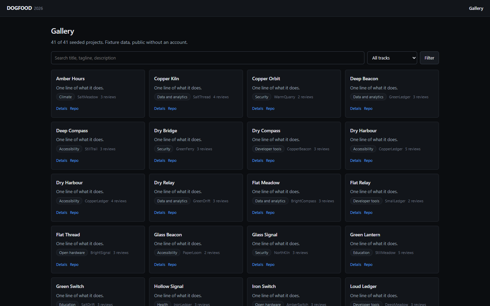
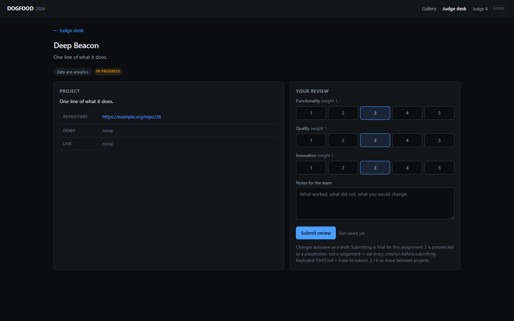
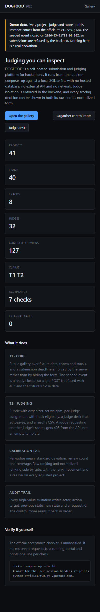
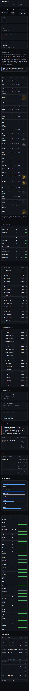

# DOGFOOD

[](https://github.com/vaibhav4046/dogfood-2026/actions/workflows/acceptance.yml)

**A self-hosted hackathon submission and judging platform that shows you its
working.** One command, one SQLite file, no network, no cloud account.

```bash
docker compose up --build     # -> http://localhost:8080
```

```
T1  gallery is public ................. PASS
T1  project from fixtures shown ....... PASS
T1  closed event refuses submissions .. PASS
T2  judge sees own scores ............. PASS
T2  judge cannot see peer scores ...... PASS
T2  participant blocked ............... PASS
T2  csv export works .................. PASS

claimed T1 T2, verified T1 T2
```

That is the unmodified official checker, printed by
`python official/run.py .dogfood.toml`, committed verbatim as
[`acceptance-report.txt`](acceptance-report.txt). Claimed tiers match verified
tiers.

**Watch the 1m20s demo:** [`docs/demo/demo.mp4`](docs/demo/demo.mp4)
(H.264) · [`demo.webm`](docs/demo/demo.webm) (VP8) ·
[captions](docs/demo/demo.srt) · [beat sheet](docs/demo/demo-script.md).
Recorded by driving the real portal; the middle of it is three refused requests
shown as requests and responses.

---

## What it is

Forty teams build forty different portals. This one is a judging platform where
the interesting claims are inspectable rather than asserted:

- **Judge isolation lives in the backend.** `judge_b` asking for `judge_a`'s
  scores over HTTP gets `403` with no score rows in the body. And it holds on
  *every* route, not only the one the checker probes —
  `tests/authz/surface-sweep.test.js` discovers the route table from the app
  and scans every response body, because an aggregate over all judges' rows
  leaks them just as effectively as naming one.
- **The deadline is the server's decision.** The seeded event closed in March.
  `POST /api/projects` returns `403 event_closed` naming the fixture's own close
  date, and so does `PATCH /api/projects/:id`.
- **Scoring can be audited.** Raw and normalized rankings are published side by
  side with every judge's mean, standard deviation, sample size and shrinkage
  factor. Judge means span **2.000 to 4.222** on the fixtures — a 2.222-point
  severity range, which is the problem the normalization exists to correct.
- **Results are embargoed until publish.** Scores, rankings, calibration and review counts are organizer-only; after publish `GET /api/results` is public and reviews return `409 review_locked`. Review edits are kept as append-only versions at `/api/organizer/reviews/:id/history`.
- **Every high-value mutation is on the audit log**, refusals included. "judge_b
  asked for judge_a's scores" is a row an organizer can read.
- **The audit log is a hash chain.** Each row stores `sha256(prev_hash + row)`;
  `npm run audit:verify` and `GET /api/organizer/audit/verify` report the first row that no longer matches.

Seeded on boot from the official `fixtures.json`: **41 projects, 40 teams,
8 tracks, 30 judges, 126 completed reviews**, plus the four session headers the
checker authenticates as, printed at startup.

## Ten-second tour

| Surface | Route | What to look at |
|---|---|---|
| Public gallery | `/projects` | 41 fixture projects, search and track filter, no account |
| Submission | `/submit` | Closed, and it says why — the refusal is the feature |
| Judge desk | `/judge` | Assignment queue, one-surface scoring, autosave |
| Control room | `/organizer` | Calibration lab, judge progress, what to fix next, audit log |



*Organizer control room. Real fixture data, captured by
`scripts/screenshots.js` from a running portal — not a mock-up. The same
capture run reports **0 horizontal overflow, 0 console errors and 0 undersized
tap targets** across 6 viewports from 375x812 to 1920x1080.*

| | |
|---|---|
|  |  |
| Public gallery, no account | Judge desk: rubric, notes and autosave on one surface |
|  |  |
| Landing at 390x844 | Control room at 390x844 — no overflow, 44px targets |

Session headers are printed at boot and already filled into
[`.dogfood.toml`](.dogfood.toml).

## Architecture in one picture

```
                    ┌──────────────────────────────────────────┐
  browser  ────────▶│  express                                 │
                    │                                          │
                    │   attachIdentity  ──▶ req.user           │  identity is derived
                    │        (session table only)              │  here and nowhere else
                    │            │                             │
                    │            ▼                             │
                    │   requireRole / requireJudge / …          │  every /api route
                    │            │                             │  is behind one
                    │            ▼                             │
                    │   public · participant · judge · organizer│
                    │            │                             │
                    │            ▼                             │
                    │   SQLite (WAL, foreign_keys ON)         │
                    └──────────────────────────────────────────┘
                                  │
                    normalize() ──┴──► raw rank + normalized rank + fingerprint
```

Two runtime dependencies (`express`, `better-sqlite3`). No build step, no
framework, no ORM, no client-side framework, no external service. Details and
the reasoning behind the stack choice: [`ARCHITECTURE.md`](ARCHITECTURE.md) and
[`docs/STACK-DECISION.md`](docs/STACK-DECISION.md).

## Documentation

| Document | What it answers |
|---|---|
| [`ARCHITECTURE.md`](ARCHITECTURE.md) | How the process is put together and why |
| [`DATA-MODEL.md`](DATA-MODEL.md) | Every table, every constraint, and the fixture data that forced it |
| [`JUDGING.md`](JUDGING.md) | The scoring model and the normalization mathematics |
| [`normalization-proof.md`](normalization-proof.md) | Worked numbers on the real fixtures, generated not typed |
| [`THREAT-MODEL.md`](THREAT-MODEL.md) | Fifteen attacks, current mitigation, and what is still open |

## Testing

```bash
npm test                       # 101 tests: unit, authz, integration, acceptance
npm run probe                  # 28 routes, expected status for each
npm run smoke:browser          # drives the real Judge Desk in a browser
npm run screenshots            # 6 viewports; overflow / console / tap targets
npm run prove:sweep            # reintroduces the peer-score leak and proves the sweep catches it
npm run acceptance             # the official checker, unmodified
npm run acceptance:save        # ...and writes acceptance-report.txt as UTF-8
```

`npm run smoke:browser` is the one that matters most, because it is the only
check that could catch a class of failure the others cannot. It scores a project
in a browser, waits for the debounce, reads the server back, reloads the page,
and confirms the scores returned. It found four defects that the unit tests,
the authorization tests and the official checker all passed — listed in
`ARCHITECTURE.md`.

Latest measured run, 2026-09-28:

| Check | Result |
|---|---|
| `npm test` | 101 / 101 pass |
| `npm run smoke:browser` | 19 / 19 browser assertions pass |
| `npm run probe` | 28 / 28 routes as expected |
| `npm run screenshots` | 0 overflow, 0 console errors, 0 undersized tap targets |
| `official/run.py` | **7 / 7 PASS**, `claimed T1 T2, verified T1 T2` |
| `acceptance-report.txt` | byte-identical across consecutive runs, UTF-8, 494 bytes |
| `npm run prove:sweep` | reintroduces the leak, sweep names all 31 exposed judges, file restored |

Browser-based checks need Playwright, which is an **optional** dependency
because the graded contract does not need a 150 MB browser download:

```bash
npm ci && npx playwright install chromium
```

If it is absent, those two scripts print the command to run instead of a bare
module error, and fall back to system Chrome if the headless shell is missing.
`npm test`, `npm run probe` and the official checker need nothing beyond the two
runtime dependencies.

The official `run.py` and `fixtures.json` are vendored unmodified under
[`official/`](official/) and are never edited. SHA-256 as downloaded on
2026-09-28:

```
07e479728e7e6961fcf5053e159e6dc807bae3e4b371ee088e4a17897950d290  official/spec.md
aa98963841bc8e18e8e5d76f0499697c093dd3c0055f9d73a459f592f4dcf09d  official/run.py
252896bc45d49fca69ad413be40c6bfde9d9b9f9dd8db702b3ff74eaaa181121  official/fixtures.json
```

`acceptance-report.txt` is the checker's own output, unedited. It contains one
machine-specific detail: the `fixtures:` line is the absolute path the checker
found the file at on this machine. That is the checker printing what it loaded,
which is the point of that line, so it is left alone rather than tidied.

## Limitations, stated plainly

- **Docker was never run on the machine that wrote this** (no Docker daemon). It is proven on GitHub Actions instead: [run 36605284848](https://github.com/vaibhav4046/dogfood-2026/actions/runs/36605284848) built the image with `docker compose up --build`, ran the unmodified official checker (`claimed T1 T2, verified T1 T2`), and a second job booted the same image on an `internal` network with no route out, served the gallery, and failed an outbound request as required.
- **No community voting (T3).** Not attempted. A T3 that is half-built is worse
  than a T2 that is finished, and ballot-stuffing defence without ballots is not
  a feature.
- **No pairwise / Bradley-Terry mode.** Documented as future work in
  `JUDGING.md` rather than shipped half-done.
- **CSRF token is skipped when no browser header is present.** A cookie-authenticated write with `Origin`, `Referer` or `Sec-Fetch-Site` needs the session-bound token; curl and the official checker send none of them and pass unchanged. `THREAT-MODEL.md` §9.
- **No collusion detection.** The Calibration Lab shows per-judge mean, sd and
  `lambda`, so an organizer can *see* two suspiciously flat judges. Nothing
  flags the pair, and judges who never share a project cannot be compared at
  all by this data. `THREAT-MODEL.md` §14.
- **Two kinds of session.** Real logins (password, scrypt) expire after 7 days and logout revokes them server-side. The four seeded demo logins are deterministic and last until 2099, which is what makes the acceptance run reproducible; they are demo identities and are refused outside demo mode (	ests/integration/real-auth.test.js). There is no organizer button to revoke another user's sessions yet.
- **Judge invitations are single-use, expiring links** created by the organizer. Team invitations by link are not implemented; teams are formed with the existing join route.
- **No bulk import.** Export is CSV; import is not.
- **The Judge Desk is hand-built, not a component library.** That is a real cost
  in accessibility primitives, and it is the surface to check first.
- **The four fixture data-quality problems are surfaced, not fixed.** Three teams
  share the name `StillTrail`; `prj_07` and `prj_41` are a genuine duplicate
  submission from the same team in the same track. The API refuses *new*
  duplicates; the historical one is reported in the Control Room for an
  organizer to resolve, because a submission accepted before the deadline
  cannot be un-submitted. `DATA-MODEL.md`.

## Tech stack

Node.js 22 · Express 4 · better-sqlite3 11 · server-rendered HTML · vanilla JS
for the Judge Desk · zero build step

## License

Apache-2.0. See [`LICENSE`](LICENSE).
